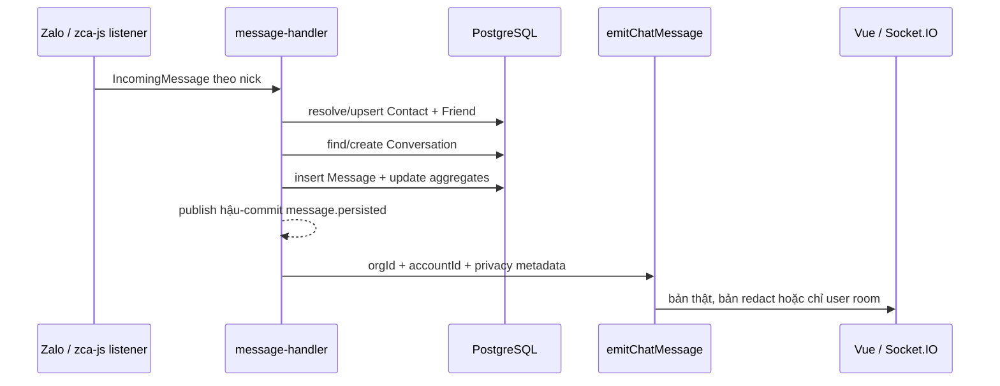
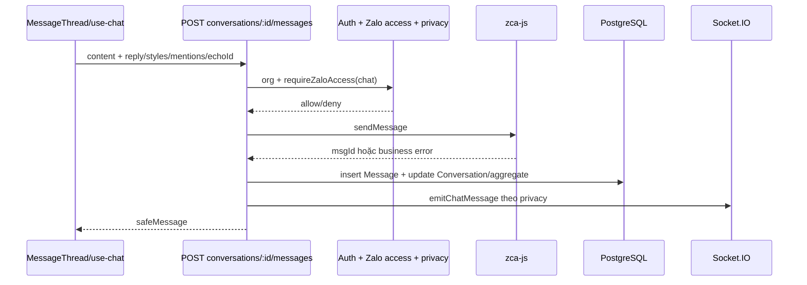
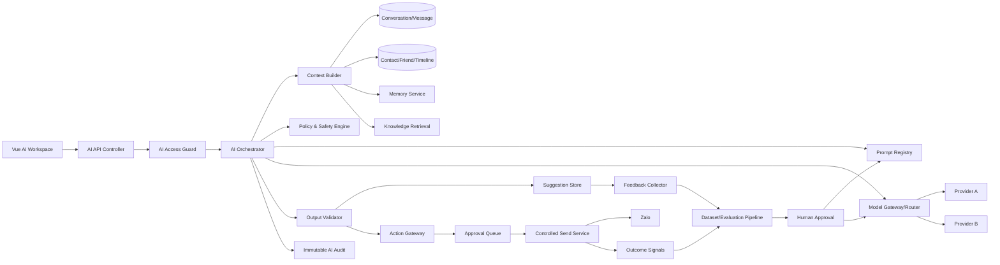
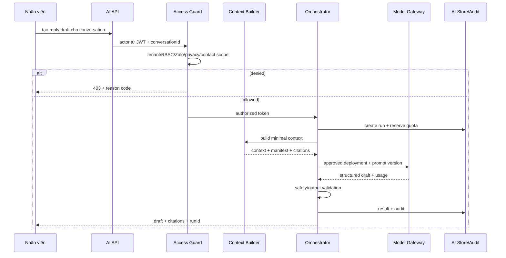
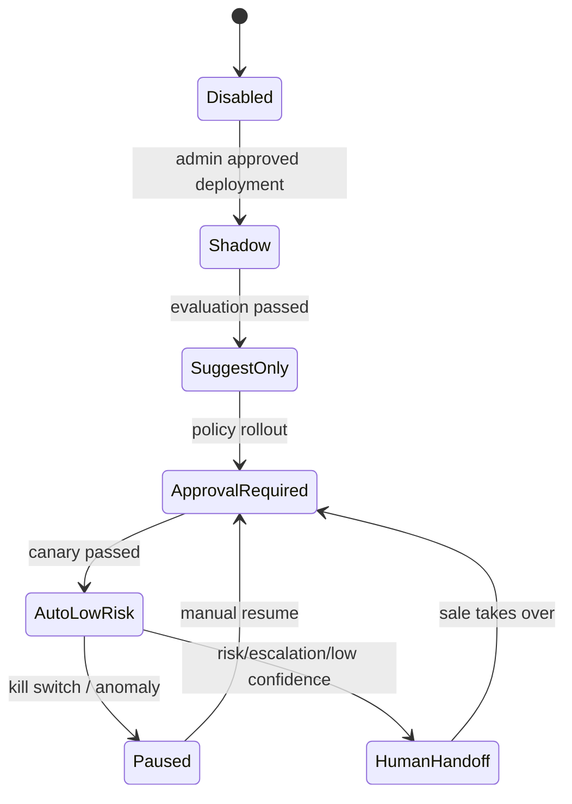

# Kiến trúc Trợ lý AI cho ZaloCRM

> Trạng thái: tài liệu thiết kế, chưa triển khai  
> Phạm vi: phân tích hệ thống hiện tại và đề xuất kiến trúc AI có kiểm soát  
> Không thuộc phạm vi tài liệu này: sửa chức năng, tạo migration, bật gửi tự động, thay đổi prompt đang chạy

## 1. Mục tiêu và nguyên tắc bất biến

Trợ lý AI phải hỗ trợ nhân viên hiểu khách hàng, đọc đúng ngữ cảnh được phép, soạn câu trả lời tự nhiên, tóm tắt, phân tích ý định/cảm xúc và đề xuất hành động. Sau khi hệ thống đã được đánh giá đủ an toàn, một phần hội thoại rủi ro thấp mới có thể được Auto Reply trong phạm vi do quản trị viên phê duyệt.

Các nguyên tắc sau là bất biến:

1. AI không phải là một user đặc quyền và không có quyền quản trị ngầm.
2. Quyền của AI không được lớn hơn quyền của người yêu cầu hoặc principal dịch vụ đã được phê duyệt.
3. Chỉ dữ liệu vượt qua tenant, RBAC, Zalo-account access, contact scope và privacy gate mới được đưa vào context.
4. Hội thoại `Conversation.isPrivate=true` chỉ chủ sở hữu hội thoại được sử dụng với AI; `owner/admin` không được bypass.
5. Nick `ZaloAccount.privacyMode='main'` vẫn yêu cầu đúng chủ nick và phiên privacy hợp lệ theo chính sách hiện tại.
6. AI không trực tiếp sửa prompt, policy, model routing, knowledge, quyền, giá, chiết khấu hoặc dữ liệu nghiệp vụ.
7. Mọi thay đổi do AI đề xuất là một `candidate`; thay đổi dữ liệu hoặc gửi tin phải đi qua action policy, quyền, validation, approval và audit.
8. AI không được xóa dữ liệu, đổi quyền, gửi hàng loạt, giảm giá, cam kết pháp lý/tài chính hoặc phát nội dung nhạy cảm.
9. Prompt và policy đang chạy phải là phiên bản bất biến đã được phê duyệt; mọi thay đổi tạo phiên bản mới và có rollback.
10. “Học” chỉ diễn ra qua pipeline dữ liệu/evaluation/deployment có phê duyệt; không tự học online bằng cách sửa cấu hình production.
11. Frontend chỉ hiển thị và thu nhận thao tác; logic AI, quyền, context, policy và audit nằm ở backend/service.
12. Fail closed đối với quyền và privacy; fail safe đối với model/provider (không chắc thì không gửi).

## 2. Phạm vi phân tích source hiện tại

Repository hiện có khoảng 883 file ngoài `node_modules/dist`; phần liên quan trực tiếp gồm 326 file frontend, 261 file backend và 120 file Prisma/migration. Phân tích đã lập inventory toàn bộ cây source/config và truy vết sâu các đường đi có ảnh hưởng tới AI:

- Frontend: bootstrap, router, Pinia stores, API client, Socket.IO client, `use-chat`, `ChatView`, `MessageThread`, `ChatContactPanel`, UI AI và trang cấu hình AI.
- Backend: bootstrap Fastify, đăng ký route/worker, auth, RBAC, tenant context/RLS, privacy, Zalo scope/access, chat routes, inbound message handler, realtime emit, customer/contact, audit, AI beta, follow-up, public API.
- Database: toàn bộ danh sách model và chi tiết các model org/user/account/contact/conversation/message/privacy/RBAC/audit/AI/follow-up.
- Vận hành: Dockerfile, Compose, PostgreSQL, Redis/BullMQ, storage, ClamAV, backup, migrate/deploy và health check.

Các file nguồn chính dùng làm source of truth:

- `frontend/src/main.ts`, `frontend/src/router/index.ts`
- `frontend/src/api/index.ts`, `frontend/src/api/socket.ts`
- `frontend/src/stores/auth.ts`, `frontend/src/stores/privacy.ts`
- `frontend/src/composables/use-chat.ts`
- `frontend/src/views/ChatView.vue`
- `frontend/src/components/chat/MessageThread.vue`
- `frontend/src/components/chat/ChatContactPanel.vue`
- `backend/src/app.ts`
- `backend/src/modules/auth/*`, `backend/src/modules/rbac/*`
- `backend/src/modules/privacy/*`
- `backend/src/modules/zalo/zalo-scope.ts`, `zalo-access-middleware.ts`, `zalo-pool.ts`
- `backend/src/modules/chat/chat-routes.ts`, `message-handler.ts`, `chat-operations-routes.ts`
- `backend/src/shared/realtime/socket-auth.ts`, `emit-chat.ts`
- `backend/src/modules/ai/*`
- `backend/src/modules/followup/*`
- `backend/src/shared/database/prisma-client.ts`, `shared/tenant/*`
- `backend/prisma/schema.prisma`, `backend/prisma/rls/tenant-rls.sql`
- `docker-compose.yml`, `docker/Dockerfile`, `scripts/zalocrm-deploy.sh`

## 3. Kiến trúc hiện tại (as-is)

### 3.1 Frontend

Frontend là Vue 3 + TypeScript + Vite, dùng Pinia, Vue Router, Vuetify và các composable `use-*` làm lớp truy cập nghiệp vụ. Production build được Fastify phục vụ từ `/app/static`; development dùng Vite port 5173 proxy `/api`, `/files` và `/socket.io` sang backend port 3000.

Luồng xác thực frontend:

- Access token và refresh token hiện lưu trong `localStorage`.
- Axios interceptor gắn Bearer token, tự refresh single-flight khi 401 và retry request.
- Socket factory dùng cùng cơ chế refresh, gửi token trong handshake và reconnect khi access token hết hạn.
- `auth.canAccess(resource, action)` chỉ là lớp UX; backend vẫn phải là nguồn quyết định quyền.

Chat desktop tập trung ở `ChatView.vue` và `use-chat.ts`:

- HTTP tải danh sách hội thoại, chi tiết, tin nhắn và gửi tin.
- Socket nhận `chat:message`, edit/delete/reaction/status/typing và vá state cục bộ.
- `MessageThread.vue` render thread, editor, privacy state, AI suggestion bar và AI virtual-message.
- `ChatContactPanel.vue` hiển thị hồ sơ, next-action, summary, sentiment, follow-up và tab AI knowledge hiện còn placeholder.
- AI suggestion hiện được chèn vào editor; nhân viên vẫn phải gửi. Đây là hành vi đúng cho giai đoạn assist.

Kết luận tích hợp frontend: không đưa SDK model, prompt builder, retrieval hay policy vào Vue component. Chỉ thêm composable/API types và component trình bày trạng thái job, citations, feedback, approval và auto-reply status.

### 3.2 Backend

Backend là Node.js ESM + Fastify 5 + TypeScript + Prisma 7/PostgreSQL. `backend/src/app.ts` khởi tạo:

- CORS, JWT, security headers, rate limit, multipart/form body, static files.
- Socket.IO và auth middleware cho socket.
- Các module auth, Zalo, chat, contact, privacy, RBAC, AI, follow-up, media, analytics, integrations.
- Worker/cron trong cùng process cho Zalo, scoring, follow-up, outreach và các tác vụ nền.

Kiến trúc đang là modular monolith. Đây là lựa chọn phù hợp cho giai đoạn đầu của AI: tạo module/service và worker rõ ràng trong cùng codebase, không vội tách microservice. Khi tải inference/ingestion lớn, worker AI có thể tách container nhưng vẫn dùng cùng contract và policy library.

### 3.3 Database và tenant

PostgreSQL 16 là nguồn dữ liệu chính. Các thực thể nền:

- `Organization`: tenant.
- `User`, `PermissionGroup`, `Department`, `DepartmentMember`: danh tính và RBAC.
- `ZaloAccount`, `ZaloAccountAccess`: nick và quyền `read/chat/admin`.
- `Contact`: hồ sơ khách hàng hợp nhất, PII, tag, trạng thái, score và aggregate.
- `Friend`: quan hệ contact × nick Zalo, UID/alias/relationship/aggregate per-nick.
- `Conversation`, `Message`: thread và tin nhắn.
- `ContactAccess`: owner/collaborator theo customer scope.
- `ActivityLog`: audit/activity chung.
- `FollowupWorkflow/Step/Enrollment/Log`: workflow follow-up và lịch sử.

`AsyncLocalStorage` mang `orgId/userId/role` qua request/worker. Prisma có tenant guard và cơ chế set RLS context. Tuy nhiên cấu hình hiện cho phép `TENANT_GUARD_MODE=off` và `RLS_SET_CONFIG=false`; file RLS ghi rõ rollout không tự động. Vì vậy thiết kế AI không được xem RLS là lớp duy nhất: mọi query vẫn phải có `orgId` và tenant context tường minh.

### 3.4 Authentication và permission

Authentication hiện dùng:

- Password bcrypt.
- Access JWT ngắn hạn (mặc định 15 phút).
- Opaque refresh token có rotation, family lifetime, reuse detection/grace window.
- Socket verify JWT và tự join `org:<orgId>`, `user:<userId>` từ token.

Permission có nhiều lớp độc lập:

1. Tenant: `orgId`.
2. RBAC resource/action trong `PermissionGroup.grants`; owner/admin legacy bypass.
3. Zalo account access: owner nick hoặc `ZaloAccountAccess.permission` (`read < chat < admin`).
4. Contact scope: `ContactAccess` của chính user hoặc department subtree.
5. Privacy nick: `privacyMode='main'` và phiên OTP.
6. Privacy hội thoại: `isPrivate=true`, chỉ `privateOwnerUserId`; kể cả org owner/admin bị chặn.

AI bắt buộc chạy qua cả sáu lớp, không được rút gọn thành “cùng org là được”.

### 3.5 Message flow hiện tại

#### Tin nhắn đến



`message-handler.ts` mirror media, chống duplicate, cập nhật Contact/Friend aggregate, ghi Message rồi emit. `emitChatMessage()` đã có xử lý riêng cho tenant, nick private và conversation private.

#### Tin nhắn đi từ nhân viên



Có idempotency qua `clientEchoId`; lỗi nghiệp vụ Zalo được lưu/hiển thị. Đây phải là đường gửi chuẩn mà Auto Reply tái sử dụng qua một application service chung, không gọi thẳng `zaloPool.api.sendMessage()` từ AI.

#### Virtual conversation

Virtual conversation lưu tin nội bộ, không gửi Zalo. Sau khi sale ghi một tin, AI beta fire-and-forget, tạo `Message.senderType='ai_assistant'`, extract entity và emit realtime. Cơ chế này là trợ lý nội bộ, không phải Auto Reply cho khách.

### 3.6 Realtime

Socket auth đã chặn client tự khai org và join room khác. `emitChatMessage()` là primitive an toàn cho nội dung chat:

- Conversation private: chỉ `user:<privateOwnerUserId>` nhận nội dung.
- Nick thường: `org:<orgId>` nhận nội dung.
- Nick main: org room nhận bản redact; owner có privacy session nhận bản thật qua user room.

Thiết kế AI phải tạo helper tương đương `emitAiEvent()` và tuyệt đối không dùng bare `io.emit()` cho dữ liệu AI. Các event AI phải có audience đã tính từ server, không phát entity/summary/citation riêng tư vào toàn org.

### 3.7 Customer data

`Contact` là hồ sơ con người hợp nhất; `Friend` là quan hệ per-nick. Context khách hàng có thể lấy từ:

- Identity: tên CRM, tên Zalo, phone/email, địa chỉ, ngôn ngữ.
- Sales state: status/statusId, assigned user, tag, notes, appointment.
- Signals: last inbound/outbound, totals, lead/priority/engagement score và pattern.
- Per-nick: alias, friendship status, last interaction, labels.
- Conversation/message: lịch sử đúng thread/nick.
- Timeline/activity/follow-up: chỉ khi user có quyền contact tương ứng.

PII không mặc định gửi toàn bộ. Context builder phải dùng allowlist theo task. Ví dụ sentiment không cần phone/email; draft có thể chỉ cần tên gọi và thông tin sản phẩm có liên quan.

### 3.8 Follow-up

Follow-up dùng PostgreSQL + BullMQ/Redis, có workflow version, send window, min gap, max message, stop conditions, enrollment và append-only log. Worker hiện chạy `advanceEnrollment()` và có thể gửi Zalo thật qua `sendCampaignMessage()`.

Đây là nguồn pattern tốt cho scheduling/idempotency/log, nhưng không nên gắn AI trực tiếp vào worker hiện tại. Trước khi dùng cho AI/Auto Reply cần có:

- RBAC và contact/Zalo scope nhất quán ở các route follow-up.
- Privacy/policy gate ngay trước thời điểm gửi nền.
- Tenant context trong worker.
- Một send command chung có idempotency, audit, consent và kill switch.

### 3.9 Docker và deployment

Production Compose hiện gồm:

- `app`: frontend + backend + worker/cron trong một image.
- `db`: PostgreSQL 16, lưu UTC.
- `redis`: Redis 7 AOF, BullMQ/cache.
- `minio`/storage volume hoặc R2.
- `backup`: backup PostgreSQL định kỳ.
- `clamav`: quét upload tùy cấu hình.

Dockerfile build frontend/backend nhiều stage, chạy `prisma migrate deploy` trước app (trừ `SKIP_MIGRATIONS=1`) và có `/health`. Deployment script backup trước nâng cấp, build, migrate, restart và health check.

Giai đoạn AI đầu có thể chạy trong `app`; ingestion và inference async dùng BullMQ queue riêng. Khi tải tăng, thêm `ai-worker` dùng cùng image/DB/Redis nhưng command riêng. Không để HTTP process giữ các job dài hoặc retry inference bằng memory-only.

## 4. Hiện trạng AI beta

Source hiện đã có các thành phần sau:

- Provider: Anthropic, Gemini, OpenAI-compatible, Qwen, Kimi.
- API key/base URL per-org; key được mã hóa trong `AppSetting.valueEncrypted`, fallback env.
- Model list động và cache 5 phút.
- `AiConfig`: provider, model, enabled, maxDaily, virtual-assistant prompt/regex.
- Tasks: reply draft, summary, sentiment, rich-format, appointment parse, virtual chat entity extraction.
- UI: config dialog/page, suggestion bar, summary, sentiment và AI virtual message.
- `AiSuggestion`, `AiSuggestionApplied`, `ActivityLog` một phần.
- Allowlist `AI_CAPABILITIES` cho virtual assistant.

Những gì chưa có hoặc chưa đủ để đạt mục tiêu cuối:

1. Chưa có AI orchestration/service boundary thống nhất; route/service gọi provider trực tiếp.
2. Chưa có request/run record đầy đủ: actor, context manifest, prompt/model version, token/cost/latency, policy decision, output hash.
3. Prompt là text mutable trong một row config; chưa có draft/review/approve/version/deploy/rollback.
4. Chưa có model deployment/version/fallback policy theo task.
5. Chưa có knowledge ingestion, chunk, embedding, ACL, citation hoặc retrieval evaluation.
6. Chưa có memory tách biệt với source-of-truth CRM.
7. Chưa có feedback event đầy đủ. Nút bỏ qua entity còn TODO; `AiSuggestion.accepted` chưa tạo learning contract đáng tin.
8. Chưa có evaluation dataset, regression gate, shadow/canary hoặc quality dashboard.
9. Quota hiện đếm row suggestion sau khi gọi; chưa có atomic reservation/cost ledger nên concurrent requests có thể vượt trần.
10. Manual AI generation chưa audit đồng bộ theo user/run; audit virtual chat là fire-and-forget.
11. `loadConversation()` chỉ khóa tenant; quyền/privacy nằm rải ở route. Service có thể bị gọi từ worker/call-site mới mà quên gate.
12. Apply AI suggestion xác minh contact cùng org nhưng chưa tái dùng đầy đủ contact scope và provenance/ownership của AI message.
13. Virtual AI context và event `chat:ai-suggestion` cần được đưa qua conversation privacy audience; không được phát entity vào org room bằng đường riêng.
14. Prompt virtual hiện chuyên biệt BĐS/HS Holding và parse output bằng separator; chưa phải contract structured-output ổn định đa-domain.
15. Provider wrapper thiếu normalized usage/cost, retry taxonomy, circuit breaker, request id, response schema và policy chung.
16. Chưa có Auto Reply state machine, approval queue, idempotent outbox, kill switch hoặc per-conversation eligibility.

Các điểm trên là khoảng trống kiến trúc cần xử lý; tài liệu không thay đổi chúng ở thời điểm này.

## 5. Kiến trúc mục tiêu

### 5.1 Sơ đồ tổng thể



### 5.2 Lựa chọn triển khai

Giai đoạn đầu: modular monolith trong backend với các package tách trách nhiệm. Không tạo logic AI trong frontend và không cho module AI truy cập tùy ý toàn Prisma.

Đề xuất cấu trúc tương lai:

```text
backend/src/modules/ai/
  api/                  # route, schema, DTO
  application/          # use cases/orchestrator
  access/               # conversation/context authorization
  context/              # context plans/builders/token budget
  policy/               # safety, action, auto-reply eligibility
  prompts/              # registry resolver, renderers
  models/               # provider adapters, routing, telemetry
  knowledge/            # ingestion/retrieval/citations
  memory/               # candidate facts and approved memory
  feedback/             # event collection and outcome linkage
  evaluation/           # offline/shadow evaluation
  actions/              # proposed actions and approval workflow
  audit/                # synchronous AI run/action audit
  workers/              # BullMQ consumers
```

Tên thư mục chỉ là thiết kế; chưa tạo trong nhiệm vụ này.

## 6. Các module và trách nhiệm

### 6.1 AI Access Guard

Đây là cổng duy nhất trước khi context được đọc. Input phải có:

- `orgId`, `actorUserId`, `actorRole` từ token/tenant context; không nhận từ body.
- `conversationId` hoặc `contactId`.
- `purpose` (`reply_draft`, `summary`, `sentiment`, `knowledge_qa`, `auto_reply`, ...).
- `requiredCapability`.

Thứ tự kiểm tra đề xuất:

1. User active và AI được bật cho org.
2. RBAC `ai_assistant.access` (resource mới) và quyền `conversation.access`.
3. Conversation tồn tại trong đúng org.
4. `checkZaloAccess(..., minPermission='read')`; action gửi yêu cầu `chat`.
5. Conversation private: chỉ `privateOwnerUserId === actorUserId`.
6. Nick main: đúng owner và privacy session hợp lệ cho task đọc nội dung.
7. Nếu đọc contact/timeline/notes/follow-up: `assertContactVisible()`.
8. Purpose/action nằm trong allowlist policy.
9. Ghi access decision vào AI run audit, kể cả deny.

Không để controller kiểm tra quyền rồi gọi service “tin tưởng”. Orchestrator phải yêu cầu một `AuthorizedAiContextToken` nội bộ do Access Guard cấp; worker phải re-authorize tại thời điểm chạy.

### 6.2 AI Orchestrator

Orchestrator điều phối, không chứa prompt hardcode hoặc provider-specific logic:

1. Tạo `AiRun` trạng thái `queued/running`.
2. Reserve quota/budget atomic.
3. Re-authorize.
4. Chọn context plan theo task.
5. Resolve prompt version + policy version + model deployment.
6. Retrieve knowledge/memory được phép.
7. Gọi Model Gateway.
8. Validate structured output và safety.
9. Lưu suggestion/result/citations.
10. Emit event đúng audience.
11. Thu usage/cost/latency và kết thúc audit.

Orchestrator không gọi gửi Zalo trực tiếp. Output muốn gửi phải tạo `AiProposedAction` và đi qua Action Gateway.

### 6.3 Context Builder

Context Builder sử dụng `ContextPlan` theo task, không “select *”. Mỗi plan định nghĩa:

- Nguồn dữ liệu được phép.
- Field allowlist và field bắt buộc redact.
- Số lượng message, cửa sổ thời gian, token budget.
- Có/không được dùng notes, appointment, follow-up, contact PII, knowledge, memory.
- Quy tắc ưu tiên và truncation.

Ví dụ:

| Task | Chat | Contact | Knowledge | PII | Memory |
|---|---:|---:|---:|---:|---:|
| Sentiment | 20–40 tin gần nhất | tên gọi tùy chọn | không | không | không |
| Summary | theo cửa sổ + summary cũ | trạng thái/tag liên quan | không | hạn chế | approved only |
| Reply draft | tin gần + summary | tên, ngôn ngữ, trạng thái | top-k có citation | không phone/email | approved only |
| Entity extract | tin mới + ít lịch sử | field đang thiếu | không | chỉ field mục tiêu | candidate facts |
| Auto reply | tin mới + compact history | tối thiểu | knowledge approved | không | approved only |

Mọi context tạo một manifest gồm source type/id/version/hash, không lưu nguyên PII trong log nếu không cần. Prompt injection từ nội dung chat/knowledge được đánh dấu là untrusted data, không phải instruction.

### 6.4 Model Gateway và Model Router

Model Gateway chuẩn hóa các provider hiện có thành contract chung:

- `generateText`, `generateStructured`, tùy chọn streaming/embedding.
- Timeout, retry chỉ cho lỗi transient trước khi có kết quả, circuit breaker.
- Idempotency key và provider request id.
- Normalized usage: input/output/cache tokens, latency, cost estimate.
- Normalized finish reason và safety result.
- Structured schema validation; không parse separator tùy ý cho contract quan trọng.
- Không ghi API key, raw authorization hoặc hidden prompt vào log.

Model Router chọn `AiModelDeployment` đã phê duyệt theo task, không lấy model tùy ý từ request. Fallback chỉ sang deployment tương đương đã kiểm thử; không tự đổi provider/model khi policy dữ liệu không cho phép.

### 6.5 Prompt Registry

Prompt không lưu như một ô text mutable duy nhất. Mô hình quản trị:

```text
Prompt Definition
  -> Draft Version
  -> Review
  -> Approved Version (immutable)
  -> Deployment by environment/task
  -> Canary/Active
  -> Rollback to previous approved version
```

Mỗi version chứa:

- System/developer template và input schema/output schema.
- Mục đích, owner, changelog, locale/domain.
- Policy/model compatibility.
- Test cases và evaluation result.
- Người tạo, reviewer, approver, timestamps và checksum.

AI không có capability tạo/approve/deploy prompt. Admin sửa draft cũng không làm thay đổi run production cho đến khi được approve/deploy.

### 6.6 Policy & Safety Engine

Policy engine chạy trước model, sau model và trước action:

- Input policy: quyền, consent, channel, privacy, task eligibility, PII minimization.
- Output policy: secret leakage, prompt leakage, harassment, sensitive content, legal/financial claim, discount/price authority, unsupported fact.
- Action policy: allow/deny/require-approval theo action, role, conversation, risk tier.
- Auto-reply policy: confidence, topic allowlist, quiet hours, last sender, customer opt-out, escalation keywords, rate limits.

Quyết định chuẩn hóa: `allow`, `deny`, `needs_human`, kèm reason codes. Free-form model text không được coi là policy decision.

### 6.7 Action Gateway

Action Gateway là đường duy nhất cho hành động do AI đề xuất:

- `draft_reply`: không mutation, có thể trả ngay.
- `send_message`: mặc định cần nhân viên approve; Auto Reply chỉ khi policy deployment cho phép.
- `update_contact_field`, `add_tag`, `create_appointment`, `enroll_followup`: tạo proposal; quyền/validation + approval riêng.
- `delete_*`, `change_permission`, `set_discount`, `change_policy`, `mass_message`: deny tuyệt đối cho AI.

Khi gửi, gateway gọi `ControlledMessageSendService` dùng lại toàn bộ guard/idempotency/rate-limit/persist/emit của chat hiện tại. Phải re-check quyền/privacy/policy ở thời điểm thực thi, vì quyền có thể thay đổi sau lúc AI tạo draft.

### 6.8 Audit Service

Audit cho AI cần mạnh hơn `ActivityLog` fire-and-forget:

- Tạo run và action audit đồng bộ trước mutation/gửi.
- Append-only; không cho AI sửa/xóa.
- Ghi actor, org, conversation/contact, purpose, model/prompt/policy/knowledge version, context manifest, input/output hash, citations, decision, usage, latency, error.
- Dữ liệu nhạy cảm được hash/redact; raw payload có retention/encryption riêng nếu thật sự cần.
- `ActivityLog` tiếp tục dùng cho timeline business; `AiRun/AiActionAudit` là log kỹ thuật/quản trị chi tiết.

Nếu audit bắt buộc không ghi được, hành động AI không được gửi/mutate.

## 7. Luồng dữ liệu đề xuất

### 7.1 Assist mode: nhân viên yêu cầu draft



Nhân viên có thể dùng nguyên văn, sửa rồi gửi hoặc bỏ qua. Việc gửi vẫn đi qua API chat chuẩn với `echoId`; feedback ghi lại chênh lệch giữa draft và nội dung gửi.

### 7.2 Knowledge Q&A

1. User đặt câu hỏi trong context conversation.
2. Access Guard khóa scope.
3. Retrieval filter theo `orgId`, collection ACL, trạng thái `approved/published`, hiệu lực thời gian và locale.
4. Hybrid search trả top-k chunk; rerank; loại chunk xung đột/expired.
5. Model chỉ trả lời từ nguồn; mỗi claim nghiệp vụ quan trọng phải có citation.
6. Không đủ nguồn: trả “chưa đủ thông tin”, không bịa.
7. UI hiển thị tên tài liệu/version/đoạn trích; feedback có `citation_helpful`.

### 7.3 Entity/memory candidate

1. AI extract structured fields với evidence message id/span và confidence.
2. Không ghi vào Contact ngay.
3. Tạo `AiMemoryCandidate` hoặc `AiProposedAction`.
4. Nhân viên xem old/new/evidence, chọn field và approve.
5. Backend re-check contact scope, whitelist và optimistic version.
6. Ghi CRM qua domain service, audit actor user + source AI run.

### 7.4 Auto Reply tương lai



Mỗi inbound message tạo một decision job. Chỉ gửi nếu:

- Deployment/org/conversation đều bật.
- Inbound message chưa được người/bot khác trả lời.
- Conversation không private ngoài principal được cấu hình.
- Nick có quyền gửi và đang connected, không archived.
- Customer không opt-out/do-not-disturb.
- Topic thuộc allowlist rủi ro thấp.
- Knowledge citations đủ mạnh và output qua safety.
- Confidence/groundedness trên ngưỡng.
- Rate limit, quiet hours và max consecutive bot replies đạt yêu cầu.
- Idempotency key chưa tồn tại.

Nếu bất kỳ điều kiện nào không chắc chắn: không gửi, tạo suggestion/handoff.

## 8. Database dự kiến

Đây là thiết kế logic, chưa phải migration. Mọi bảng tenant-scoped phải có `orgId`, index phù hợp và RLS policy khi rollout.

### 8.1 Cấu hình, model và prompt

#### `AiModelDeployment`

- `id`, `orgId`, `name`, `taskType`
- `provider`, `model`, `baseUrlRef`, `credentialRef`
- `parameters` (temperature, token limits, structured mode)
- `dataPolicy` (region, retention, PII allowed)
- `status`: draft/testing/canary/active/paused/retired
- `fallbackDeploymentId`
- `createdById`, `approvedById`, `approvedAt`
- `version`, `checksum`, timestamps

#### `AiPromptDefinition`

- `id`, `orgId`, `key`, `taskType`, `name`, `description`, `ownerUserId`

#### `AiPromptVersion`

- `id`, `promptDefinitionId`, `version`
- `systemTemplate`, `inputSchema`, `outputSchema`
- `policyVersionId`, `changelog`, `checksum`
- `status`: draft/in_review/approved/rejected/retired
- `createdById`, `reviewedById`, `approvedById`, timestamps
- Unique `(promptDefinitionId, version)`; approved rows immutable.

#### `AiPromptDeployment`

- `id`, `orgId`, `environment`, `taskType`
- `promptVersionId`, `modelDeploymentId`
- `rolloutPercent`, `status`, `effectiveFrom`, `effectiveTo`
- `deployedById`, `rollbackOfId`

### 8.2 Runs, quota và audit

#### `AiRun`

- `id`, `orgId`, `actorUserId`, `actorType`
- `purpose`, `status`, `riskTier`
- `conversationId`, `contactId`, `triggerMessageId`
- `promptVersionId`, `modelDeploymentId`, `policyVersionId`
- `contextManifest`, `knowledgeSnapshotId`
- `inputHash`, `outputHash`, `errorCode`
- `inputTokens`, `outputTokens`, `costMicros`, `latencyMs`
- `startedAt`, `completedAt`, `expiresAt`

#### `AiUsageLedger`

- `id`, `orgId`, `aiRunId`, `provider`, `model`, `taskType`
- token/cost fields, `reservationStatus`, `periodKey`, timestamps

Quota dùng reservation atomic trong transaction; finalize/refund sau run. Không dùng `count(AiSuggestion)` làm quota chính.

#### `AiActionAudit`

- `id`, `orgId`, `aiRunId`, `actorUserId`
- `actionType`, `targetType`, `targetId`
- `decision`, `reasonCodes`, `approvalId`
- `requestHash`, `resultHash`, `status`, timestamps

### 8.3 Suggestion, approval và outbox

#### `AiSuggestionV2`

- `id`, `orgId`, `aiRunId`, `conversationId`, `contactId`
- `type`, `payload`, `evidence`, `confidence`, `citations`
- `status`: generated/shown/accepted/edited/rejected/expired
- `createdAt`, `expiresAt`

#### `AiProposedAction`

- `id`, `orgId`, `aiRunId`, `actionType`, `payload`
- `targetType`, `targetId`, `riskTier`
- `policyDecision`, `status`
- `requiresApproval`, `expiresAt`, timestamps

#### `AiApproval`

- `id`, `orgId`, `proposedActionId`
- `requestedFromUserId`, `decidedByUserId`
- `decision`, `comment`, `beforeSnapshot`, `approvedPayload`
- `decidedAt`, `expiresAt`

#### `AiSendOutbox`

- `id`, `orgId`, `proposedActionId`, `conversationId`, `zaloAccountId`
- `idempotencyKey` unique
- `payload`, `status`, `attemptCount`, `nextAttemptAt`
- `providerMessageId`, `failureCode`, timestamps

Outbox chỉ chứa action đã được policy/approval cho phép. Worker re-authorize trước gửi.

### 8.4 Knowledge

#### `AiKnowledgeCollection`

- `id`, `orgId`, `name`, `description`
- `visibility`: org/department/restricted
- `status`, `ownerUserId`, timestamps

#### `AiKnowledgeAcl`

- `collectionId`, subject type/id (user/department/permission group)
- `permission`: read/manage/publish

#### `AiKnowledgeDocument`

- `id`, `orgId`, `collectionId`, `title`, `sourceType`, `sourceUri`
- `mimeType`, `language`, `effectiveFrom`, `effectiveTo`
- `status`: uploaded/processing/in_review/published/rejected/expired
- `contentHash`, `version`, `supersedesId`
- `createdById`, `approvedById`, timestamps

#### `AiKnowledgeChunk`

- `id`, `orgId`, `documentId`, `chunkIndex`
- `content`, `contentHash`, `metadata`
- `embeddingModel`, `embeddingVersion`, `embedding`
- search index fields, timestamps

#### `AiKnowledgeSnapshot`

- Immutable danh sách document version/chunk dùng trong một deployment/evaluation.

Không đưa file vừa upload vào retrieval production trước khi scan, parse, ACL, review và publish.

### 8.5 Memory

#### `AiConversationMemory`

- `orgId`, `conversationId`, `scope`, `summary`, `facts`
- `sourceMessageThroughId`, `version`, `generatedByRunId`
- `status`: candidate/approved/stale/revoked
- `approvedByUserId`, timestamps

#### `AiMemoryCandidate`

- `orgId`, `contactId`, `conversationId`, `fieldKey`, `proposedValue`
- `evidenceMessageIds/spans`, `confidence`, `aiRunId`
- `status`, `reviewedById`, timestamps

Memory không thay thế Contact/Message. Khi CRM source thay đổi, memory phải stale/rebuild. Không ghi lại secret hoặc dữ liệu private sang memory dùng chung.

### 8.6 Feedback và evaluation

#### `AiFeedbackEvent`

- `id`, `orgId`, `aiRunId`, `suggestionId`, `actorUserId`
- `eventType`: shown/copied/accepted/edited/sent/rejected/thumb_up/thumb_down/citation_helpful
- `originalHash`, `finalHash`, `editDistance`, `reasonCode`, `metadata`, timestamp

#### `AiOutcomeLink`

- `aiRunId`, `contactId`, `conversationId`
- outcome type/value, attribution window, observedAt
- Chỉ là correlation; không khẳng định nhân quả nếu chưa có experiment.

#### `AiEvaluationDataset/Sample/Run/Result`

- Dataset version bất biến, dữ liệu đã scope/redact.
- Sample có input snapshot, expected rubric/output và reviewer.
- Evaluation run khóa prompt/model/policy/knowledge snapshot.
- Result lưu metric, judge version và regression flags.

## 9. API dự kiến

Tất cả route dùng JWT auth, tenant context, schema validation, rate limit và quyền backend.

### 9.1 Assist

- `POST /api/v1/ai/runs`
  - Body: `{ purpose, conversationId?, contactId?, triggerMessageId?, locale? }`
  - Response sync ngắn hoặc `{ runId, status:'queued' }`.
- `GET /api/v1/ai/runs/:id`
  - Chỉ actor hoặc role có grant/audience tương ứng; privacy re-check.
- `POST /api/v1/ai/runs/:id/cancel`
- `POST /api/v1/ai/suggestions/:id/feedback`
  - `{ eventType, finalText?, reasonCode? }`.
- `POST /api/v1/ai/suggestions/:id/propose-action`
- `POST /api/v1/ai/approvals/:id/decision`

Giữ route beta hiện tại trong giai đoạn chuyển tiếp; adapter gọi orchestrator mới, sau đó deprecate có telemetry.

### 9.2 Knowledge

- CRUD collection/document có grant `ai_knowledge.*`.
- `POST /knowledge/documents/:id/publish` yêu cầu reviewer/approver.
- `POST /knowledge/search/test` chỉ môi trường quản trị, trả citations và retrieval diagnostics.
- Không cho frontend gửi raw SQL/filter ACL tùy ý.

### 9.3 Prompt/model/policy management

- CRUD draft version.
- Submit review, approve/reject, deploy, rollback là endpoint riêng.
- Quyền tạo khác quyền approve/deploy (separation of duties).
- Mọi action audit trước/sau; AI không được gọi các endpoint này.

### 9.4 Auto Reply

- `GET/PATCH /ai/auto-reply/policy` cho draft policy.
- `POST /ai/auto-reply/policy/:version/approve`.
- `POST /ai/auto-reply/deployments/:id/pause|resume`.
- `POST /ai/auto-reply/kill-switch` yêu cầu quyền cao, hiệu lực tức thời, audit synchronous.
- `GET /ai/auto-reply/decisions` để điều tra allow/deny/handoff.

## 10. Tích hợp với chat hiện tại

### 10.1 Frontend

Giữ `ChatView/use-chat` là nơi điều phối UI, nhưng tách API AI thành composable riêng như `use-ai-assistant`:

- Submit/cancel/poll AI run.
- Nhận `ai:run-updated`, `ai:suggestion`, `ai:approval-required` qua socket.
- Hiển thị citations, confidence, policy warnings.
- Ghi feedback explicit và implicit.
- Chèn draft vào editor; không tự emit `send` ở assist mode.

`MessageThread` không chứa prompt/model logic. `ChatContactPanel` có thể dùng tab AI hiện đang placeholder cho knowledge Q&A và evidence.

### 10.2 Backend

Refactor mục tiêu sau này (không làm trong tài liệu):

- Tách logic gửi trong `chat-routes.ts` thành `ControlledMessageSendService`.
- Route nhân viên và AI Action Gateway cùng gọi service này.
- Service nhận authenticated principal, không nhận `orgId/role` tùy ý từ body.
- Service re-check account, conversation privacy, connected/archived, idempotency, rate limit, consent, persist, aggregate, audit và `emitChatMessage()`.

### 10.3 Realtime audience

Event AI phải có helper server-side:

- Conversation private: chỉ private owner room.
- Nick main: chỉ đúng owner đã unlock cho payload chứa content; org room chỉ nhận metadata tối thiểu nếu policy cho phép.
- Nick thường: chỉ các user thực sự có quyền conversation, tốt nhất dùng conversation/user audience thay vì phát toàn org.
- Không gửi raw context/prompt/provider response qua socket.

### 10.4 Race và idempotency

- Một inbound message chỉ có tối đa một auto-reply decision theo `(deploymentId, triggerMessageId)`.
- Trước gửi, kiểm tra có human/self/bot reply sau trigger chưa.
- Nếu sale gửi trong lúc AI đang chạy, cancel/supersede auto action.
- Outbox idempotency ngăn retry gửi trùng.
- Model timeout không đồng nghĩa được retry gửi; chỉ retry inference nếu chưa tạo send action.

## 11. Quản lý context

Context được chia lớp:

1. System/policy instructions: trusted, versioned.
2. Organization style/profile: approved config.
3. Knowledge chunks: untrusted content nhưng approved source, luôn delimit và citation.
4. CRM/contact data: structured facts, field allowlist.
5. Conversation history: untrusted user content.
6. Current user request: untrusted input.

Token budget theo thứ tự ưu tiên:

1. Policy/system không bị truncate.
2. Tin mới nhất và trigger message.
3. Approved memory/compact summary.
4. Relevant knowledge citations.
5. Older history theo relevance/time.

Không dùng một summary cũ nếu source message đã bị xóa/ẩn/quyền thay đổi. Context cache key phải chứa org, actor/audience, privacy state, source version và task; không cache raw private context dùng chung.

## 12. Quản lý memory

Ba tầng memory:

- Working memory: chỉ sống trong một run, không persist ngoài audit tối thiểu.
- Conversation memory: compact summary/facts theo conversation, versioned và re-authorized khi đọc.
- Customer memory: candidate facts có evidence; chỉ sau human approval mới trở thành CRM data/approved memory.

Quy tắc:

- Không tự merge contact, đổi status, tag nhạy cảm hoặc ghi notes production.
- Mỗi fact phải có provenance/evidence và confidence.
- Fact xung đột tạo candidate mới; không ghi đè im lặng.
- Có revoke/stale/rebuild và retention.
- Memory của conversation private không được dùng ở conversation khác hoặc org-wide knowledge.

## 13. Quản lý knowledge

Pipeline đề xuất:

1. Upload/connect source.
2. Antivirus/mime/size validation.
3. Parse và normalize.
4. Phân loại PII/secret và policy scan.
5. Chunk theo cấu trúc tài liệu, không chỉ số ký tự.
6. Embed với model/version cố định.
7. Human review và publish.
8. Snapshot cho deployment.
9. Hybrid retrieval + ACL filter trước search và sau retrieval.
10. Citation/grounded answer.

Nguồn phù hợp: catalog sản phẩm, bảng giá đã duyệt, chính sách, FAQ, kịch bản sale, tài liệu triển khai. Không tự coi tin nhắn khách hàng hoặc câu trả lời nhân viên là knowledge doanh nghiệp.

Khi tài liệu hết hiệu lực, chunk phải bị loại khỏi retrieval ngay. Với giá/ưu đãi, citation cần version và effective date; nếu nguồn xung đột hoặc quá hạn thì bắt buộc handoff.

## 14. Feedback và học có kiểm soát

### 14.1 Feedback cần thu

- Suggestion có được hiển thị không.
- Accept nguyên văn, sửa, bỏ qua, từ chối và lý do.
- Nội dung cuối cùng nhân viên gửi (hash/diff; raw chỉ khi retention cho phép).
- Customer reply, sentiment shift, response time, appointment, status/goal/sale outcome.
- Citation helpful/incorrect/missing.
- Safety escalation, complaint, opt-out, manual override.

### 14.2 Không dùng trực tiếp feedback để sửa production

Pipeline học:

```text
Feedback events
  -> lọc quyền/PII/quality
  -> dataset candidate
  -> human labeling/review
  -> immutable dataset version
  -> offline evaluation
  -> prompt/model candidate
  -> security/safety review
  -> shadow/canary
  -> human approve deployment
```

Không fine-tune hoặc thay prompt tự động chỉ vì conversion tăng. Sales outcome có nhiều confounder; chỉ là signal hỗ trợ, không phải ground truth duy nhất.

### 14.3 Chống poisoning

- Không học từ conversation private sang phạm vi rộng.
- Không học từ content chứa prompt injection hoặc secret.
- Dedup, spam/bot detection và source weighting.
- Mẫu training phải trace về source và consent/retention.
- Có quyền xóa/revoke dataset sample khi source bị xóa hợp lệ.

## 15. Đánh giá chất lượng AI

### 15.1 Bộ metric

#### Chất lượng

- Task success/rubric score.
- Groundedness và citation precision/recall.
- Hallucination/unsupported claim rate.
- Intent, sentiment, entity extraction precision/recall/F1.
- Tone/policy compliance.
- Vietnamese naturalness và brand consistency.

#### Assist outcome

- Suggestion shown → used rate.
- Accept without edit, edit rate, normalized edit distance.
- Time saved/response latency.
- Human rejection reason distribution.

#### Auto Reply safety

- False-send rate.
- Escalation recall.
- Complaint/opt-out rate.
- Consecutive-bot-loop rate.
- Duplicate send rate (mục tiêu 0).
- Unauthorized context/send rate (mục tiêu 0).

#### Reliability/cost

- p50/p95 latency, timeout/error/rate-limit.
- Queue age, circuit breaker, provider failover.
- Token/cost per task/org/conversation.

### 15.2 Evaluation gates

Một deployment không được active nếu:

- Có regression quyền/privacy/safety.
- Structured output invalid vượt ngưỡng.
- Groundedness/citation dưới ngưỡng task.
- Auto Reply escalation recall chưa đạt mục tiêu.
- Chưa pass test prompt injection, cross-tenant, private conversation, stale knowledge, duplicate event và provider timeout.

### 15.3 Test layers

- Unit: access guard, policy, context redaction, output schema, idempotency.
- Integration: Prisma tenant scope, RBAC/Zalo/privacy combinations, provider mock, BullMQ.
- Contract: provider adapters và structured output.
- E2E: inbound → suggestion → employee edit/send → feedback.
- Security: cross-org IDOR, private conversation, socket audience, prompt injection, SSRF base URL, secret leakage.
- Load/chaos: concurrent quota, Redis outage, provider timeout, restart worker, duplicate webhook/socket.

## 16. Auto Reply: phạm vi và cơ chế bật

### 16.1 Risk tiers

- Tier 0: nội bộ (summary/sentiment), không gửi.
- Tier 1: draft cho nhân viên.
- Tier 2: action cần một người approve.
- Tier 3: auto reply rủi ro thấp, knowledge-grounded, canary nhỏ.
- Tier 4: nhạy cảm/giá/ưu đãi/khiếu nại/pháp lý/tài chính: luôn handoff, không auto.

### 16.2 Cấu hình nhiều lớp

Auto Reply cần đồng thời bật ở:

1. Global kill switch.
2. Organization approved deployment.
3. Zalo account/channel allowlist.
4. Conversation/customer eligibility.
5. Topic/risk policy.

Chỉ một cờ false là dừng. Kill switch không phụ thuộc model/provider và phải có hiệu lực trước khi dequeue/gửi.

### 16.3 Handoff

Handoff khi:

- Khách yêu cầu gặp người thật.
- Khiếu nại, giận dữ cao, nhạy cảm, rủi ro pháp lý/tài chính.
- Hỏi giá/chiết khấu ngoài knowledge approved.
- Low confidence, nguồn xung đột/hết hạn.
- Hai lần AI không giải quyết hoặc khách lặp lại.
- Sale bắt đầu nhập/gửi.

Handoff tạo notification/task, tóm tắt có citation và khóa bot trong cooldown cho đến khi nhân viên resume có chủ đích.

## 17. Rủi ro kỹ thuật và biện pháp

| Rủi ro | Hiện trạng/liên quan | Biện pháp bắt buộc |
|---|---|---|
| Cross-tenant leakage | RLS/tenant guard có thể đang off | org filter + tenant context + test + rollout RLS |
| Private content leak | Nhiều đường HTTP/socket/worker | central Access Guard + audience helper + fail closed |
| Virtual/private AI leak | virtual AI và event entity là đường riêng | re-authorize context và emit per audience |
| Prompt mutable không audit | `AiConfig` text trực tiếp | immutable PromptVersion + approval/deploy |
| AI apply sai customer data | apply route chưa đủ scope/provenance | domain service + contact scope + evidence + approval |
| Quota race/cost spike | count suggestion sau call | atomic usage reservation ledger |
| Duplicate auto reply | socket/retry/worker restart | trigger/outbox idempotency + last-reply check |
| Hallucinated policy/price | chưa có knowledge/citation | published snapshot + groundedness + handoff |
| Prompt injection | chat/knowledge là untrusted | instruction hierarchy, delimit, tool/action policy |
| API key/secret leakage | provider config tồn tại | encryption, secret refs, log redaction, rotation |
| SSRF/custom base URL | base URL chỉnh per-org | allowlist/safe outbound validation/network egress |
| Worker mất tenant context | job nền có call-site chưa bọc | job chứa orgId + `withTenant` + enforce guard |
| Bare Socket.IO broadcast | một số shared flow còn `io.emit` | event audience abstraction + static grep/test gate |
| Follow-up gửi ngoài policy | worker có đường gửi thật | không reuse trực tiếp; Controlled Send + privacy/policy |
| Provider retention/residency | nhiều provider | deployment data policy + provider contract/DPA |
| Online learning poisoning | feedback từ chat có thể độc | curated dataset + review + no direct production update |
| Audit mất nhưng action vẫn chạy | audit hiện có fire-and-forget | synchronous audit prerequisite cho AI action |
| PWA/cache UI cũ | frontend có service worker | API compatibility, versioned events, migration rollout |
| Single-process contention | worker/HTTP cùng container | queue limits; tách `ai-worker` khi cần |

## 18. Lộ trình triển khai

### Giai đoạn 0 — Security baseline và contract

- Không mở tính năng mới.
- Chuẩn hóa ma trận quyền AI, conversation access service và privacy tests.
- Thống nhất Controlled Send contract, AI event audience và audit requirements.
- Lập evaluation dataset baseline từ dữ liệu được phép/redact.
- Rà soát các đường AI/follow-up/public send hiện có.

Exit criteria: test cross-tenant/private/socket/worker pass; không có AI call-site đọc conversation ngoài Access Guard thiết kế.

### Giai đoạn 1 — AI Foundation

- AiRun, usage ledger, model deployment, prompt registry/version.
- Model Gateway normalized và provider mocks.
- Orchestrator + Context Builder tối thiểu.
- Adapter cho reply draft/summary/sentiment beta.
- Observability, cost/latency dashboard.

Chỉ assist; không mutation/auto send.

### Giai đoạn 2 — Assist workspace hoàn chỉnh

- Reply draft có citations/context explanation tối thiểu.
- Feedback shown/used/edited/rejected.
- Entity extraction thành proposal có evidence.
- Approval trước update Contact/appointment/tag.
- UI states queued/running/error/cancelled.

### Giai đoạn 3 — Knowledge RAG

- Collection/document ACL, ingestion, review/publish/version.
- Hybrid retrieval, citations, stale/expiry handling.
- Knowledge Q&A trong tab AI hiện đang placeholder.
- Retrieval/groundedness evaluation.

### Giai đoạn 4 — Memory có kiểm soát

- Conversation compact memory.
- Memory candidate + human approval.
- Conflict/stale/revoke và privacy isolation.
- Không tự ghi source-of-truth.

### Giai đoạn 5 — Evaluation và learning loop

- Immutable datasets, offline eval, human review.
- Prompt/model candidate comparison.
- Shadow traffic và canary tooling.
- Outcome linkage nhưng không tự deploy.

### Giai đoạn 6 — Approval-required actions

- AiProposedAction/AiApproval/AiSendOutbox.
- Controlled Send Service dùng chung với chat.
- Draft → approve → send, idempotency và audit synchronous.
- Kill switch và incident playbook.

### Giai đoạn 7 — Auto Reply shadow mode

- Chạy decision/draft trên inbound nhưng không gửi.
- So sánh với phản hồi nhân viên và đánh giá missed escalation.
- Chỉ task/topic allowlist; quan sát tối thiểu đủ chu kỳ kinh doanh.

### Giai đoạn 8 — Auto Reply canary rủi ro thấp

- Tỷ lệ nhỏ theo org/nick/conversation allowlist.
- Limit consecutive bot replies, quiet hours, handoff và rollback tức thời.
- Mở rộng chỉ khi metric/safety gate đạt; không mở theo mặc định.

## 19. Quyền đề xuất

RBAC hiện chưa có resource AI riêng. Đề xuất thêm trong một migration tương lai:

- `ai_assistant`: access/use/feedback.
- `ai_knowledge`: access/create/edit/publish/delete.
- `ai_prompt`: access/create/edit/review/approve/deploy.
- `ai_model`: access/edit/test/deploy.
- `ai_auto_reply`: access/edit/approve/pause.
- `ai_audit`: access/view_all.

Nếu hệ action hiện chỉ có `access/create/edit/delete/view_all`, cần thiết kế extension cho action `review/approve/deploy/pause` hoặc biểu diễn thành resource tách biệt. Không ép “approve” vào `edit`, vì phải separation of duties.

Quyền AI luôn giao với quyền dữ liệu hiện có. Có `ai_assistant.access` không đồng nghĩa được đọc mọi conversation.

## 20. Observability và vận hành

Metrics/log cần có `aiRunId`, `orgId` (không log PII), task, deployment version:

- Run count/status/latency/token/cost.
- Provider error/rate-limit/circuit state.
- Queue depth/age/retry/dead-letter.
- Policy allow/deny/handoff reason.
- Feedback/quality metrics.
- Auto reply decision/send/duplicate/escalation.

Alert:

- Unauthorized/privacy deny tăng bất thường.
- Cost/token spike.
- Provider error/latency.
- Invalid structured output.
- Complaint/opt-out/safety spike.
- Outbox stuck hoặc duplicate attempt.
- Audit write failure.

Deployment phải giữ backup/migrate/health hiện tại, bổ sung readiness cho Redis/provider không nên làm app core chết nếu AI assist tắt. Auto Reply phải tự pause khi dependency/audit/policy store không healthy.

## 21. Các quyết định cần được phê duyệt trước khi code

1. AI vendor/data residency/retention và hợp đồng xử lý dữ liệu.
2. Bộ resource/action RBAC AI và separation of duties.
3. Dữ liệu nào được gửi ra provider cho từng task.
4. Retention/encryption của raw AI input/output.
5. Vector store: PostgreSQL/pgvector hay dịch vụ riêng.
6. Knowledge ownership và quy trình publish.
7. Risk taxonomy, topic allowlist và ngưỡng handoff.
8. Metric/threshold để chuyển phase.
9. Ai được bật Auto Reply và kill switch owner.
10. Chính sách consent/opt-out và giới hạn kênh Zalo.
11. Tách `ai-worker` từ giai đoạn nào.
12. Có cho phép provider fallback chéo vùng/nhà cung cấp hay không.

## 22. Definition of Done cho hệ thống AI hoàn chỉnh

Hệ thống chỉ được coi là hoàn chỉnh khi:

- Mọi AI run có actor, quyền, prompt/model/policy/knowledge version và audit trace.
- Không có đường đọc conversation bỏ qua Access Guard.
- Không có event AI content dùng bare global broadcast.
- AI suggestion không tự mutation; action có policy/approval/audit.
- Prompt/model/policy production bất biến và rollback được.
- Knowledge có ACL, version, publish và citation.
- Memory có evidence, approval, stale/revoke.
- Feedback và outcome tạo dataset versioned, không tự sửa production.
- Evaluation regression/safety gate chạy trong CI/release process.
- Controlled Send idempotent và re-authorize tại thời điểm gửi.
- Auto Reply có shadow/canary, topic allowlist, handoff, kill switch và incident audit.
- Unauthorized send, cross-tenant leak, private-conversation leak và duplicate send có mục tiêu bằng 0 và test bắt buộc.

## 23. Kết luận

ZaloCRM đã có nền móng tốt cho một Trợ lý AI: dữ liệu chat/contact phong phú, AI provider beta, UI suggestion/summary/sentiment, tenant/auth/RBAC/privacy, Socket.IO và BullMQ. Tuy nhiên không nên mở rộng trực tiếp từ các route/provider beta sang Auto Reply.

Hướng an toàn là dựng một AI control plane trong backend gồm Access Guard, Orchestrator, Context Builder, Prompt/Model Registry, Knowledge/Memory, Policy, Action Gateway, Audit, Feedback và Evaluation. Assist mode phải được hoàn thiện và đo lường trước; Auto Reply chỉ là một deployment mode ở cuối lộ trình, dùng cùng quyền và send service hiện tại nhưng có thêm policy, approval, idempotent outbox, handoff và kill switch.

Tài liệu này không tạo migration và không thay đổi chức năng đang chạy.
