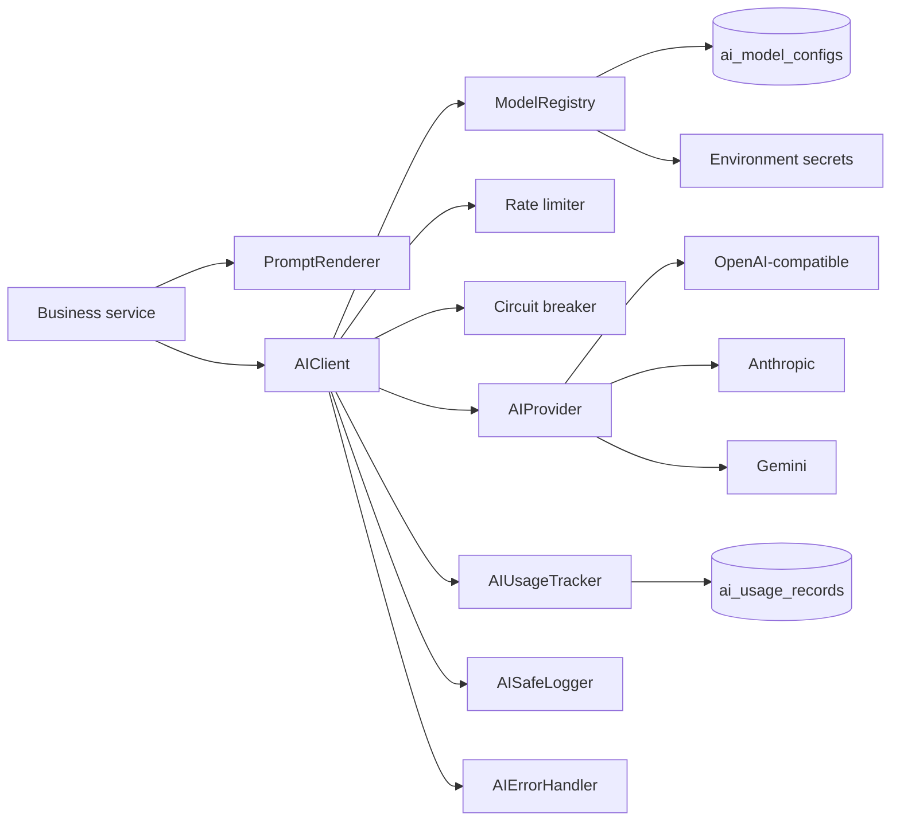

# Dịch vụ lõi AI

## Phạm vi

AI Core Service là nền tảng gọi model dùng chung cho backend ZaloCRM. Module này chưa tự động trả lời khách hàng, chưa đọc hội thoại và không thay đổi prompt, policy hay dữ liệu nghiệp vụ. Business service phải tự kiểm tra quyền trước khi truyền context vào AI Core.

## Kiến trúc



Các module:

- `AIProvider`: interface request/response/token/stream độc lập provider.
- `AIClient`: orchestration timeout, retry, rate limit, fallback, circuit breaker, structured output và streaming.
- `ModelRegistry`: đọc model configuration theo `org_id`, resolve adapter và secret environment.
- `PromptRenderer`: render biến `{{path.to.value}}`, báo lỗi khi thiếu biến.
- `AIUsageTracker`: tính token/cost và ghi `ai_usage_records` khi request có `runId`.
- `AISafeLogger`: mặc định chỉ log metadata allowlist; bỏ API key, authorization, prompt, message, content và raw response.
- `AIErrorHandler`: chuẩn hóa lỗi authentication, timeout, rate limit, provider unavailable, invalid request/response và circuit open.

## Model configuration

Mỗi cấu hình nằm trong `ai_model_configs`, phải thuộc đúng organization, chưa soft-delete và có `status=active` hoặc `approved`.

`credential_ref` chỉ chấp nhận tên biến môi trường dạng:

```text
env:OPENAI_API_KEY
env:ANTHROPIC_API_KEY
env:GEMINI_API_KEY
```

Nếu không khai báo, registry dùng `<PROVIDER>_API_KEY`. Giá trị secret không được đọc từ database và không xuất hiện trong API response/log.

Các field hỗ trợ trong JSON `parameters`:

| Field | Mặc định | Giới hạn / ý nghĩa |
|---|---:|---|
| `baseUrl` | bắt buộc | URL HTTPS của provider. |
| `timeoutMs` | 30000 | 1–120 giây. |
| `maxRetries` | 2 | 0–5; chỉ retry lỗi retryable. |
| `rateLimitPerMinute` | 60 | Theo organization + model config trong process. |
| `circuitFailureThreshold` | 5 | Số request thất bại trước khi mở circuit. |
| `circuitResetMs` | 30000 | Thời gian trước half-open probe. |
| `fallbackModelConfigId` | không có | Model cùng organization; chỉ dùng khi lỗi primary retryable. |
| `inputCostPerMillion` | 0 | Giá theo một triệu input token. |
| `outputCostPerMillion` | 0 | Giá theo một triệu output token. |
| `cachedInputCostPerMillion` | 0 | Giá cached input token. |

Giá được lưu thành `cost_micros` để tránh sai số số thực. Khi triển khai nhiều instance, rate limiter và circuit breaker in-memory nên được thay bằng Redis adapter dùng chung; API test còn có Fastify rate limit riêng.

## Cách gọi

```ts
const result = await aiClient.complete({
  orgId,
  modelConfigId,
  runId,
  taskType: 'summary',
  messages: [
    { role: 'system', content: systemPrompt },
    { role: 'user', content: authorizedContext },
  ],
  structuredOutput: {
    name: 'summary',
    schema: { type: 'object', properties: { summary: { type: 'string' } } },
    validate: isSummary,
  },
});
```

Đổi provider/model chỉ cần đổi `modelConfigId` hoặc dữ liệu `ai_model_configs`; business logic không cần sửa.

Streaming khả dụng qua `aiClient.stream()` khi adapter provider hỗ trợ. Hiện OpenAI-compatible hỗ trợ SSE streaming; provider không hỗ trợ trả lỗi `CONFIGURATION` rõ ràng.

## API kiểm tra nội bộ

```http
POST /api/v1/ai/internal/test-connection
Authorization: Bearer <admin-token>
Content-Type: application/json

{ "modelConfigId": "..." }
```

Yêu cầu:

- User đã xác thực.
- Role `owner` hoặc `admin`.
- Có grant `settings:edit`.
- Tối đa 5 request/phút theo Fastify route rate limit.

Response chỉ trả trạng thái, request ID, provider/model, fallback, latency, token và cost. Không trả API key hoặc nội dung model. Prompt kiểm tra là chuỗi cố định không chứa dữ liệu khách hàng.

## Retry, fallback và circuit breaker

1. Rate limit được kiểm tra một lần cho logical request.
2. Request có AbortController theo `timeoutMs`.
3. Chỉ lỗi retryable (timeout, 429, 5xx, network đã normalize) được retry, tối đa `maxRetries`.
4. Khi primary vẫn lỗi, fallback chỉ chạy nếu được cấu hình và khác primary.
5. Sau số lần logical request lỗi liên tiếp đạt ngưỡng, circuit mở và fail-fast.
6. Hết `circuitResetMs`, một request half-open được thử; thành công reset circuit, thất bại mở lại.

## Logging và dữ liệu nhạy cảm

Log mặc định chỉ chứa request ID, organization ID, provider/model, task, attempt, status, error code, latency và token. Nội dung được biểu diễn bằng SHA-256 hash khi cần correlation. Không truyền object request/provider response vào logger.

Usage chỉ được persist khi có `runId` hợp lệ để giữ foreign key/audit chain. Connection test vẫn trả usage trong response nhưng không tạo record rời không gắn AI run.

## Kiểm thử

`tests/unit/ai-core-service.test.ts` kiểm tra:

- Structured output và validation.
- Token/cost tracking.
- Retry có giới hạn.
- Fallback model.
- Circuit breaker.
- Rate limiting.
- Safe logger redaction.
- Prompt renderer.

Chạy:

```powershell
npx vitest run tests/unit/ai-core-service.test.ts
npm run build
```
