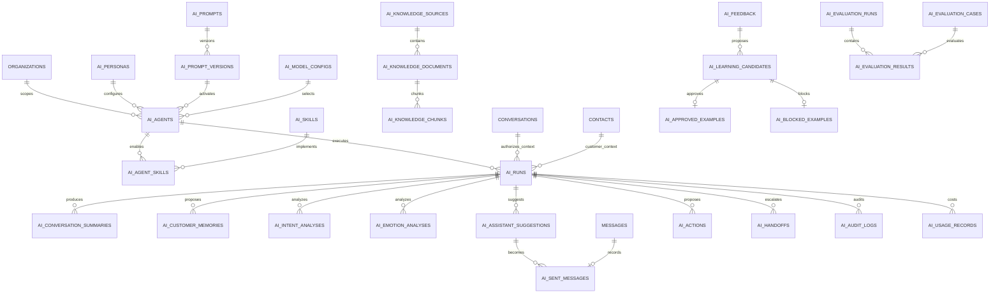

# Database Trợ lý AI

## Phạm vi và nguyên tắc

Thiết kế bổ sung 28 bảng `ai_*`, không đổi cấu trúc hay dữ liệu bảng cũ. Mọi bảng có `org_id`, foreign key và index tenant. Service vẫn phải kiểm tra quyền xem hội thoại trước khi tạo `ai_runs`, kể cả hội thoại riêng tư.

- Không lưu API key/token; `credential_ref` chỉ trỏ tới secret manager hoặc biến môi trường.
- Nội dung nhạy cảm dùng `bytea` mã hóa; chỉ giữ hash/redacted khi cần.
- `ai_sent_messages` trỏ tới `messages`, không sao chép nội dung đã gửi.
- Bảng cấu hình/tri thức/dataset có `deleted_at`; audit, usage và runtime history không soft delete.

## ERD

## Danh mục bảng

| Nhóm | Bảng | Mục đích |
|---|---|---|
| Agent | `ai_agents`, `ai_personas` | Agent và persona mã hóa, trạng thái, auto-reply mode. |
| Agent | `ai_skills`, `ai_agent_skills` | Skill và liên kết nhiều-nhiều. |
| Prompt | `ai_prompts`, `ai_prompt_versions` | Prompt logic, version và phê duyệt. |
| Model | `ai_model_configs` | Provider/model/policy; chỉ lưu credential reference. |
| Knowledge | `ai_knowledge_sources`, `ai_knowledge_documents`, `ai_knowledge_chunks` | Nguồn, tài liệu/version, chunk và embedding. |
| Runtime | `ai_runs` | Lần gọi AI, context manifest, model/prompt, hash I/O. |
| Context | `ai_conversation_summaries`, `ai_customer_memories` | Summary versioned và memory có evidence/approval. |
| Analysis | `ai_intent_analyses`, `ai_emotion_analyses` | Nhãn/confidence/lý do redacted. |
| Output | `ai_assistant_suggestions`, `ai_sent_messages` | Gợi ý và liên kết message thật/idempotency. |
| Learning | `ai_feedback`, `ai_learning_candidates` | Feedback và candidate chờ review. |
| Learning | `ai_approved_examples`, `ai_blocked_examples` | Kết quả review có kiểm soát. |
| Control | `ai_actions`, `ai_handoffs` | Action có risk/approval và chuyển nhân viên. |
| Evaluation | `ai_evaluation_cases`, `ai_evaluation_runs`, `ai_evaluation_results` | Dataset, run và metric theo case. |
| Governance | `ai_audit_logs`, `ai_usage_records` | Audit append-only, token, latency và cost. |

## Tích hợp và bảo mật

`ai_runs` liên kết với `conversations`, `contacts`, `messages`. Foreign key không thay thế permission: backend phải xác nhận user có quyền đọc trước khi lấy context. `context_manifest` chỉ lưu ID/version/hash, không lưu toàn bộ hội thoại.

Mọi truy vấn ID phải kèm `org_id`. RLS nên triển khai riêng sau khi connection pool luôn set tenant context. Key mã hóa nằm ngoài database. Chỉ cấu hình approved mới dùng cho auto reply. AI không được xóa dữ liệu, giảm giá, đổi policy/prompt hay tự duyệt learning candidate.

## Migration và rollback

- Forward: `backend/prisma/migrations/20260710150000_ai_assistant_database/migration.sql`.
- Rollback: `rollback.sql` cùng thư mục; Prisma không tự chạy file này.
- Không chạy production trước khi review SQL, backup, test staging.
- Rollback xóa dữ liệu 28 bảng AI, chỉ dùng sau khi backup/export.

Mọi lần xem context, sinh nội dung, duyệt action, gửi message và handoff phải ghi audit log.
